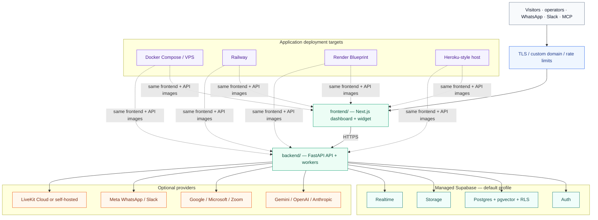
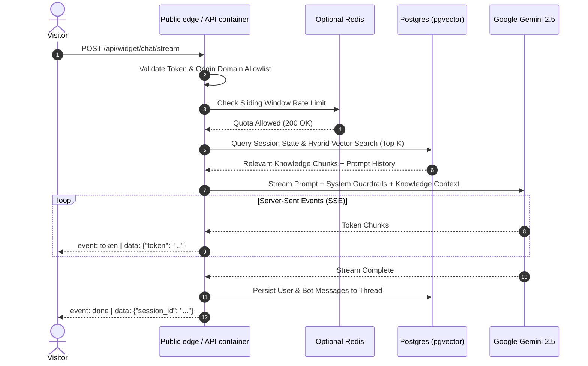

export const metadata = { title: "Architecture", description: "Deep dive into Chatty's backend infrastructure, data flow, concurrency model, and security boundaries." }

import { Note, Tip, Warning, Info } from "@/components/mdx/Callout"
import { Card, CardGroup } from "@/components/mdx/Card"
import { Accordion, AccordionGroup } from "@/components/mdx/Accordion"
import { PageNav } from "@/components/PageNav"
import { prevNext } from "@/lib/navigation"

# Platform Architecture

Chatty is a multi-tenant AI customer-support platform with a Next.js frontend,
FastAPI application services, Supabase-backed persistence, streaming chat, RAG,
voice, booking, omnichannel webhooks, and MCP access. The managed-Supabase
profile is the default for both Chatty Cloud and self-hosted application
containers.

This document breaks down the request flow, data boundaries, and deployment
security model without implying that a self-hosted deployment must replace
Supabase or use a specific cloud vendor.

---

## High-Level Topology

Chatty follows a two-service application boundary: the public frontend calls
the API over HTTPS, and the API talks to managed Supabase plus optional
providers. The same containers can run on a VPS, Railway, Render, or a
Heroku-style container host:



---

## Core Infrastructure Layers

<CardGroup cols={2}>
  <Card title="Asynchronous ASGI Engine" icon="⚡">
    Built on <b>FastAPI</b> and <b>Uvicorn</b> inside the API container. Every network I/O call (database queries, vector similarity, optional Redis counters, LLM tokens) is non-blocking.
  </Card>
  <Card title="Vector RAG Pipeline" icon="🧠">
    Powered by <b>Supabase PostgreSQL</b> with <b>pgvector</b>. Uses 768-dimensional embeddings generated by Google's `text-embedding-004` model with indexed HNSW cosine distance search.
  </Card>
  <Card title="Persistent Edge Rate Limiting" icon="🛡️">
    Optional distributed rate limiting and ephemeral state backed by <b>Upstash Redis</b>. The managed-Supabase profile works without provisioning a local Redis service.
  </Card>
  <Card title="Multi-Channel Adapters" icon="🔌">
    Native support for the Embed Widget, React SDK, WordPress plugin, WhatsApp Business API, and Model Context Protocol (MCP).
  </Card>
</CardGroup>

---

## The Request Lifecycle

When a visitor interacts with a Chatty widget or API client, the request traverses multiple verification and processing stages:



### 1. Ingress & Origin Allowlist
Public widget endpoints check the incoming HTTP `Origin` header against the bot's configured **domain allowlist**. If a domain is not authorized, the backend immediately terminates the connection with `403 Forbidden` and injects `Content-Security-Policy: frame-ancestors 'none'` to block unauthorized iframe embedding.

### 2. Distributed rate limiting (optional)
To protect backend workers from volumetric abuse, deployments can use the
Upstash Redis token bucket integration. Counters are partitioned by client IP
(for widget traffic) or SHA-256 API key hash (for developer API calls). The
managed-Supabase default still runs without a locally provisioned Redis.

### 3. Session Resolution & Human Takeover Check
The conversation session UUID is retrieved from PostgreSQL. If the session has `ai_paused: true` (e.g. a customer support agent initiated a human takeover), the AI pipeline is bypassed, and the visitor message is routed directly to the Live Inbox dashboard.

### 4. Hybrid Knowledge Retrieval (RAG)
If knowledge sources exist, Chatty performs hybrid retrieval:
1. **Semantic Vector Search**: Computes cosine distance against `knowledge_chunks` using `pgvector` embeddings (`<=>` operator).
2. **Keyword Filtering**: Matches high-confidence lexical tokens.
3. Top results are deduplicated, reranked, and formatted with document metadata (source URL, file title, page number) into the LLM system prompt.

### 5. Non-Blocking SSE Streaming
The orchestrator dispatches the assembled context to Google Gemini with streaming enabled. Token generators yield `text/event-stream` chunks directly through FastAPI's `StreamingResponse`, achieving Time-To-First-Token (TTFT) under 400ms.

---

## Concurrency & Database Pooling

Database connection exhaustion is the most common failure point in AI applications that handle long-running LLM streams. Chatty mitigates this with a robust pooling architecture:

```
[API container instances]
         │
         ├── Worker 1 ──┐
         ├── Worker 2 ──┼──> [Async SQLAlchemy Engine]
         └── Worker N ──┘            │
                                     ▼
                     [Application connection pool]
                        - pool_size: 20
                        - max_overflow: 44
                        - pool_timeout: 30s
                        - pool_recycle: 1800s
                        - pool_pre_ping: true
                                     │
                                     ▼
                     [Supabase Transaction Pooler]
                              (Port 6543)
```

<AccordionGroup>
  <Accordion title="Pre-Ping & Automatic Recycling">
    Database connections are configured with `pool_pre_ping=True` and a 30-minute recycle window (`pool_recycle=1800`). Dead connections caused by network partitions are evicted before a query attempts execution.
  </Accordion>
  <Accordion title="Immediate Connection Release During Streaming">
    FastAPI sessions only hold a database connection while loading session history and vector chunks. The database transaction is closed **before** the long-running LLM streaming loop starts. Once the stream ends, a new pooled connection is acquired for a few milliseconds to save the completed response.
  </Accordion>
  <Accordion title="Keep-Alive Redis HTTP Pooling">
    Upstash Redis operations utilize a singleton HTTP transport with persistent TCP keep-alive sockets. This eliminates SSL handshake latency on every rate limit check.
  </Accordion>
</AccordionGroup>

---

## Security Boundaries & Isolation

Chatty enforces enterprise security boundaries at every level of the stack:

| Boundary | Mechanism | Purpose |
| :--- | :--- | :--- |
| **Tenant Isolation** | PostgreSQL Row-Level Security (RLS) | Restricts database records strictly to the authenticated `user_id` or bot owner. |
| **SSRF Prevention** | Pre-flight DNS resolution & IP pinning | Prevents Server-Side Request Forgery against cloud metadata (`169.254.169.254`) and private RFC-1918 subnets. |
| **Upload Safety** | Stream-capped chunked readers (20MB) | Enforces maximum upload byte caps before writing to disk, preventing memory exhaustion and DoS. |
| **JWT Verification** | Asymmetric JWKS public key validation | Verifies Supabase authentication tokens cryptographically with cached public key rotation. |
| **BYOK Encryption** | AES-256-GCM symmetric encryption | Encrypts customer-supplied API keys (OpenAI, Anthropic, Gemini) before database persistence. |

<Note>
For detailed security specifications, vulnerability reporting, and GDPR compliance, visit our [Security & Privacy](/security) reference.
</Note>

<PageNav {...prevNext("/architecture")} />
