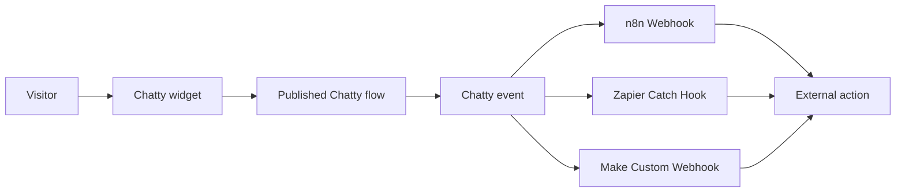

export const metadata = { title: "Flow Integrations", description: "Connect Chatty flows to n8n, Zapier, and Make with signed webhooks." }

import { Note, Tip, Warning, Info } from "@/components/mdx/Callout"
import { Card, CardGroup } from "@/components/mdx/Card"
import { PageNav } from "@/components/PageNav"
import { prevNext } from "@/lib/navigation"

# Flow Integrations

Chatty owns the conversation flow. External automation platforms handle optional side effects.

This is the same boundary used by mature customer-engagement products:



Chatty does not add n8n, Zapier, Make, Google Sheets, Stripe, or CRM nodes to the Chatty conversation palette. Connect those products through a signed Chatty webhook. Use the Chatty public API when an external workflow must read or change Chatty data.

<Note title="Production boundary">
  A Chatty flow controls visitor-facing behavior. An external workflow performs an integration side effect. Keep this boundary clear so a slow third-party API does not block the visitor conversation.
</Note>

## Where created flows appear

Open **Flow Builder** from the Chatty dashboard. The builder uses the single Chatty application route:

```text
/flow?bot_id=YOUR_BOT_ID
```

When no `flow_id` or new-flow flag is present, this route opens **My flows**. It lists only flow records saved for the selected Chatty bot. It does not create a placeholder flow and it does not show demo data.

Each saved flow card shows:

- The flow name.
- Draft or Live status.
- Last update time.
- Node count.
- Connection count.
- Latest saved version.
- Open editor, enable, pause, and delete actions.

Select **New workflow** to open an empty editor. Select **Open editor** on a saved card to open:

```text
/flow?bot_id=YOUR_BOT_ID&flow_id=YOUR_FLOW_ID
```

Use **My flows** in the editor breadcrumb to return to the flow directory. A canvas appears in My flows only after you save it.

## Authentication and ownership

Flow Builder uses the active Chatty session. When Chatty opens the builder, it can pass a short-lived handoff token. The builder stores that handoff only for the selected bot and removes it from the browser URL.

The Chatty API checks the user session or handoff before every flow request. It also checks the user permission for the selected bot. A user cannot read or edit another bot's flows by changing the URL.

If the builder shows an authentication error:

1. Return to the Chatty dashboard.
2. Open the correct bot.
3. Select **Flow Builder** again.
4. Do not open a copied flow URL from an expired handoff.

## Chatty node palette

The palette is Chatty-first. Use these nodes to build the visitor journey:

<CardGroup cols={2}>
  <Card title="Chatty event" icon="◈">
    Start a flow from a Chatty event such as a new session, message, lead, meeting, or CSAT event.
  </Card>
  <Card title="Reply in chat" icon="💬">
    Send a message to the visitor. Message fields support Chatty event values such as `data.content` and `session_id`.
  </Card>
  <Card title="Webhook" icon="↗">
    Receive an HTTP event when an external system starts a Chatty flow.
  </Card>
  <Card title="HTTP request" icon="⇄">
    Call a controlled HTTPS endpoint. Use this for an application-owned adapter or an external automation webhook.
  </Card>
  <Card title="Wait" icon="◷">
    Pause the flow for a delay or a later event.
  </Card>
  <Card title="Condition" icon="⑂">
    Branch on a visitor or event value with a declarative comparison.
  </Card>
  <Card title="AI transform" icon="✦">
    Classify, extract, or summarize data before the next Chatty step.
  </Card>
</CardGroup>

Third-party platforms are outbound destinations. They are not native Chatty nodes. This keeps the node palette small, makes the conversation graph portable, and keeps provider credentials out of visitor-facing flow data.

## Save, test, and publish

Use this lifecycle for every production flow:

1. Add a trigger node.
2. Add Chatty replies, conditions, waits, and controlled HTTP actions.
3. Connect every node with explicit edges.
4. Select **Save draft**.
5. Select **Test** to run graph validation and a dry-run trace. A dry run has no external side effects.
6. Fix every validation error.
7. Select **Publish**.
8. Enable the flow from **My flows** only after review.

Publishing requires at least one trigger. It also requires required node configuration, valid connections, and an acyclic graph. A draft is not active in the widget.

<Warning title="Do not use a test flow in production">
  Review the trigger, message copy, conditions, URLs, credentials, and failure paths before publishing. External automation platforms have separate test and production URLs.
</Warning>

## Connect Chatty to n8n

Use an n8n **Webhook** node as the entry point for an n8n workflow.

### Configure n8n

1. Create an n8n workflow.
2. Add a **Webhook** node.
3. Select the HTTP method expected by the node. Chatty sends `POST` requests.
4. Copy the n8n **Production URL**.
5. Add the URL to Chatty under **Dashboard → Developer API → Webhooks**.
6. Select the Chatty events that should start the n8n workflow.
7. Save the Chatty webhook and copy its signing secret.
8. Activate the n8n workflow.
9. Create a real Chatty event and inspect the n8n execution.

Use the n8n **Test URL** only while the workflow is listening for a test request. Use the Production URL for an active Chatty webhook.

In n8n, verify `X-Chatty-Signature` before changing records or calling another service. Add an idempotency step that uses the event identifier from the Chatty payload when your workflow can receive the same event more than once.

## Connect Chatty to Zapier

Use **Webhooks by Zapier → Catch Hook** as the Zap trigger.

1. Create a Zap.
2. Select **Webhooks by Zapier**.
3. Select **Catch Hook**.
4. Copy the generated hook URL.
5. Add the URL to Chatty under **Dashboard → Developer API → Webhooks**.
6. Select the event filters.
7. Save the Chatty webhook.
8. Send a real or controlled test event.
9. Select **Test trigger** in Zapier.
10. Map `event`, `bot_id`, `session_id`, `timestamp`, and `data` into the action steps.
11. Add a signature verification step before sensitive actions.
12. Publish the Zap.

Keep the Zap trigger focused. Use separate Chatty webhook subscriptions when different event groups need different Zap permissions or destinations.

## Connect Chatty to Make

Use a Make **Custom webhook** as the scenario entry point.

1. Create a scenario.
2. Add **Webhooks → Custom webhook**.
3. Create a webhook and copy its URL.
4. Add the URL to Chatty under **Dashboard → Developer API → Webhooks**.
5. Select the Chatty events for the scenario.
6. Save the Chatty webhook.
7. Run the Make scenario once so the webhook listens for data.
8. Send a Chatty event.
9. Confirm the sample payload in Make.
10. Add filters, routers, and actions.
11. Verify the Chatty signature before sensitive actions.
12. Activate the scenario.

Use a Make filter for `event` when one scenario receives several Chatty event types. Use separate Chatty subscriptions when the destinations or permissions differ.

## Webhook event contract

Every delivery uses the same envelope:

```json
{
  "event": "lead.created",
  "bot_id": "a1b2c3d4-...",
  "session_id": "visitor-xyz-789",
  "timestamp": "2026-07-07T12:34:56Z",
  "data": {}
}
```

The current event catalog is:

| Group | Events |
|---|---|
| Session | `session.started`, `session.ended`, `session.assigned`, `session.resolved`, `session.transferred` |
| Messages | `message.user`, `message.assistant`, `message.agent` |
| Leads | `lead.created`, `lead.updated`, `lead.exported` |
| Meetings | `meeting.booked`, `meeting.cancelled`, `meeting.rescheduled` |
| SLA | `sla.first_response_breached`, `sla.resolution_breached` |
| CSAT | `csat.submitted` |
| Knowledge | `knowledge.source_added`, `knowledge.source_deleted` |

The `data` object depends on the event. Treat unknown fields as forward-compatible. Use the `event` field to select the correct schema in n8n, Zapier, or Make.

Read [Webhooks](/guides/webhooks) for payload examples and signature verification code.

## Register a webhook by API

Create a scoped Chatty API key for the bot. The key needs the `write` scope to create a subscription.

```bash
curl -X POST \
  "https://api.chatty.personaliai.com/api/v1/webhooks" \
  -H "Authorization: Bearer chatty_sk_your_key" \
  -H "Content-Type: application/json" \
  -d '{
    "url": "https://your-automation.example.com/chatty-hook",
    "events": ["lead.created", "message.assistant"]
  }'
```

The response includes a signing secret. Store it in the destination platform immediately. Chatty does not return the secret again from the list endpoint.

Use the dashboard endpoint when a Chatty team member manages the subscription:

```text
POST /api/bots/{bot_id}/webhooks
```

Use the public API endpoint when an API key manages the subscription:

```text
POST /api/v1/webhooks
```

Both paths validate the URL, restrict events to the event catalog, and scope the subscription to one bot.

## Verify the signature

Chatty sends the `X-Chatty-Signature` header. Its value is the hexadecimal HMAC-SHA256 digest of the exact raw request body and the webhook secret.

```python
import hashlib
import hmac

def is_chatty_request(raw_body: bytes, signature: str, secret: str) -> bool:
    expected = hmac.new(
        secret.encode("utf-8"),
        raw_body,
        hashlib.sha256,
    ).hexdigest()
    return hmac.compare_digest(expected, signature)
```

Verify the raw bytes before parsing JSON. Do not re-serialize the parsed object before verification. Reject the request when the header is missing or the digest does not match.

For n8n, Zapier, and Make, put verification in an application-owned gateway when the platform cannot safely verify the raw body. The gateway can verify the signature, add an idempotency record, and forward only accepted events to the automation platform.

## Reliability and delivery behavior

Chatty delivers webhooks asynchronously. The visitor flow does not wait for the external platform to finish.

- Chatty uses at-least-once delivery.
- Chatty waits up to 10 seconds for a destination response.
- Chatty retries failed deliveries at 1 second, 5 seconds, 30 seconds, 5 minutes, 30 minutes, 2 hours, and 8 hours.
- Chatty makes 7 attempts in total, including the initial attempt.
- Chatty retries connection errors, timeouts, and server errors.
- A successful 2xx response acknowledges the delivery.
- The delivery log is available in the Chatty Developer API webhook section.

Build every destination to be idempotent. A retry or a network timeout can produce a duplicate request even when the first request reached the destination.

## Security requirements

Use these controls in production:

- Use an HTTPS destination.
- Store the Chatty signing secret in the automation platform secret store.
- Verify the signature over the raw request body.
- Use a separate webhook subscription for each trust boundary.
- Give API keys the smallest required scope.
- Keep provider credentials in n8n, Zapier, Make, or your application secret store.
- Do not place API keys or provider secrets in flow messages or event data.
- Rotate the webhook when a destination secret is exposed.
- Delete unused subscriptions.
- Treat event fields as untrusted input.
- Add idempotency before non-reversible actions such as charging a card or sending an email.

<Tip title="Keep Chatty responsive">
  Put slow work after the webhook trigger. Return a successful response after the destination has accepted the event. Let the external platform manage long-running work and provider-specific retries.
</Tip>

## Production checklist

Before enabling a flow and its integrations, confirm:

- The flow appears in **My flows** for the correct bot.
- The flow has a trigger and every connection is intentional.
- The flow passes **Test** without side effects.
- The flow is published and enabled.
- The external platform uses its production webhook URL.
- The Chatty webhook subscription contains only the required events.
- The signing secret is stored outside source code.
- Signature verification runs before sensitive actions.
- Duplicate events are safe to process.
- The Chatty delivery log and external execution log show a successful test.
- Failure, retry, and dead-letter handling have an owner.

## Troubleshooting

### A created flow does not appear in My flows

Save the canvas first. Confirm that the URL contains the correct `bot_id`. Confirm that the current user can edit the selected bot. Unsaved canvases are intentionally not listed.

### n8n, Zapier, or Make receives no event

Confirm that the external workflow is active and that Chatty uses the production URL. Confirm that the Chatty webhook is active and subscribes to the event that actually occurred. Check the delivery log for HTTP status and attempt count.

### Signature verification fails

Use the secret returned when the webhook was created. Read the raw request body before JSON parsing. Do not trim, pretty-print, or re-serialize the body before calculating HMAC-SHA256.

### An external action runs twice

Treat the delivery as at-least-once. Store an idempotency key derived from the event identity before executing the side effect. Return success for a previously processed event.

### The flow builder asks for authentication

Open Flow Builder from the Chatty dashboard again. The builder needs the active Chatty session or a valid short-lived handoff for the selected bot.

<Info title="Related documentation">
  Start with [Visual Flow Architect](/guides/flow-architect) for flow design. Use [Webhooks](/guides/webhooks) for payload and verification details. Use the API reference for Chatty data operations.
</Info>

<PageNav {...prevNext("/guides/flow-integrations")} />
