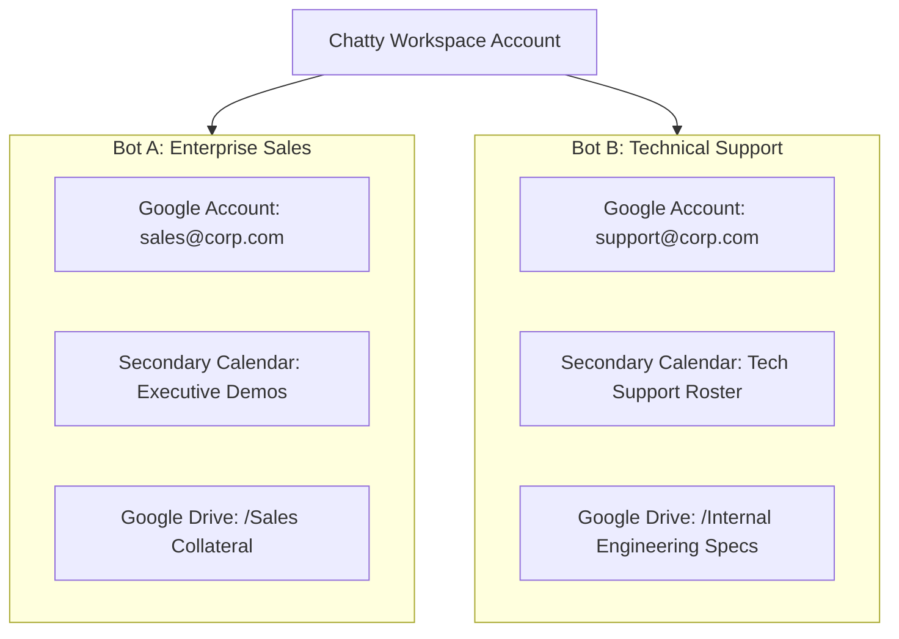

export const metadata = { title: "Per-Bot Integrations & Isolation", description: "Bind individual bots to dedicated Google/Microsoft accounts, secondary calendars, and scoped Google Drive folders." }

import { Note, Tip, Warning, Info } from "@/components/mdx/Callout"
import { Card, CardGroup } from "@/components/mdx/Card"
import { PageNav } from "@/components/PageNav"
import { prevNext } from "@/lib/navigation"

# Per-Bot Integrations & Multi-Tenant Isolation

In multi-product or agency setups, different chatbots in the same Chatty workspace often require distinct Google accounts, separate calendar availability, and dedicated document folders.

Chatty supports **granular per-bot integration bindings**, preventing data bleed and ensuring enterprise-grade multi-tenant separation.

---

## Isolation Architecture

---

## Capabilities

<CardGroup cols={3}>
  <Card title="Connected Account Binding" icon="🔑">
    Bind each bot to a specific connected account (`kin_connected_accounts`) or inherit the workspace default account.
  </Card>
  <Card title="Secondary Calendar Targeting" icon="📅">
    Target a specific `google_calendar_id` (not hardcoded to `"primary"`). Bookings and free/busy intervals remain completely isolated.
  </Card>
  <Card title="Google Drive Folder Scoping" icon="📁">
    Strictly scope RAG document crawling and vector search to `google_drive_folder_id` per bot.
  </Card>
</CardGroup>

---

## Configuring Per-Bot Settings

1. Open your bot in the **Chatty Dashboard &rarr; Settings**.
2. Under **Calendar & Meeting Integrations**:
   - Select your **Google Account** (Workspace Default or Connected Account).
   - Select your **Target Calendar** from the live dropdown list.
3. Under **Knowledge Base**:
   - Choose the specific **Google Drive Folder** to index.

<Note>
Cross-tenant verification is strictly enforced: any API request attempting to bind an account ID belonging to a different tenant is rejected with a `403 Forbidden` error.
</Note>

<PageNav {...prevNext("/guides/per-bot-integrations")} />
