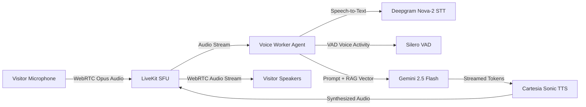

export const metadata = { title: "Real-Time Voice Agent", description: "Deploy sub-second WebRTC conversational voice agents powered by LiveKit, Cartesia Sonic, and Deepgram." }

import { Note, Tip, Warning, Info } from "@/components/mdx/Callout"
import { Card, CardGroup } from "@/components/mdx/Card"
import { PageNav } from "@/components/PageNav"
import { prevNext } from "@/lib/navigation"

# Real-Time Voice Agent

Chatty embeds an enterprise WebRTC voice pipeline that turns your AI assistant into a speaking conversational phone and browser agent with human-like latency under **500ms**.

Visitors can tap the **Call** button in the chat widget header or visit the full-screen `/voice-demo` portal to talk naturally, interrupt the bot at any moment (barge-in), and receive answers sourced from your knowledge base.

---

## The WebRTC Audio Pipeline



---

## Core Audio Capabilities

<CardGroup cols={2}>
  <Card title="Instant Interruption (Barge-In)" icon="⚡">
    Silero Voice Activity Detection (VAD) detects when the visitor starts speaking and cuts off the bot's speech output instantly, mirroring natural human conversation.
  </Card>
  <Card title="Knowledge Base Grounding" icon="🧠">
    The voice worker has full access to the bot's vector embeddings, knowledge collections, and scheduling tools during the live call.
  </Card>
  <Card title="Sub-500ms Latency" icon="⏱️">
    Streamlined WebRTC audio frames combined with Cartesia Sonic streaming TTS produce ultra-low latency voice output.
  </Card>
  <Card title="Live Call Transcripts" icon="📝">
    Full audio transcripts and speaker diarization are logged in real-time to the Chatty Live Inbox for agent review.
  </Card>
</CardGroup>

---

## Generating Client Room Tokens

To initiate a voice call from your frontend or custom mobile application, request a secure LiveKit connection token from the Chatty API:

```bash
curl -X POST https://api.chatty.personaliai.com/api/voice/token \
  -H "Authorization: Bearer YOUR_BOT_ID" \
  -H "Content-Type: application/json" \
  -d '{
    "bot_id": "YOUR_BOT_ID",
    "visitor_id": "visitor_user_123"
  }'
```

### Response

```json
{
  "token": "eyJhbGciOiJIUzI1NiIsInR5cCI6IkpXVCJ9...",
  "server_url": "wss://livekit.chatty.personaliai.com",
  "room_name": "call_bot_123_visitor_user_123"
}
```

<Tip>
Connect to the `server_url` using LiveKit Client SDKs (`livekit-client` in JavaScript/TypeScript, Swift for iOS, Kotlin for Android).
</Tip>

<PageNav {...prevNext("/guides/voice-agent")} />
